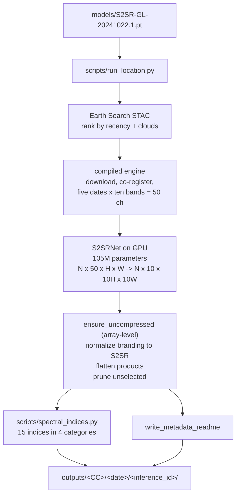
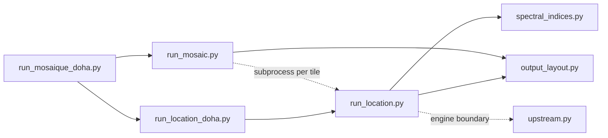
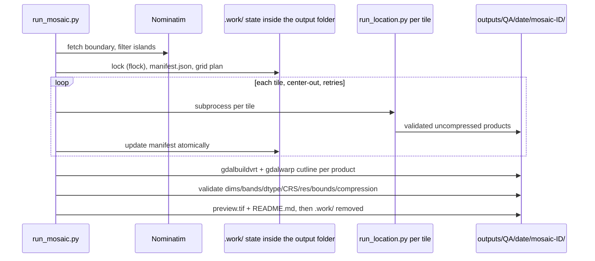

# NeuralQ S2SR API

Local Sentinel-2 super-resolution platform. It pairs a recovered,
clean-room reimplementation of a 105-million-parameter temporal
super-resolution network (`s2sr/`) with a compiled geospatial engine for
STAC access and co-registration, and adds orchestration for single
locations, municipality mosaics, and multi-year time series - all running
fully local under the NeuralQ S2SR brand. Every raster the pipeline
produces is uncompressed, organized under one predictable layout, and
self-documented.

## Repository Layout

```
neuralq-s2sr-api/
├── README.md                        this document
├── environment.yml                  conda spec for the neuralq-s2sr-api environment
├── models/
│   └── S2SR-GL-20241022.1.pt        decrypted checkpoint        (840,950,460 B)
├── s2sr/                            clean-room model package
│   ├── __init__.py                  public exports
│   ├── model.py                     S2SRNet architecture + load_model
│   └── inference.py                 predict_normalized / super_resolve_dn
├── scripts/                         orchestration layer
│   ├── upstream.py                  single integration boundary to the compiled engine
│   ├── output_layout.py             country codes, inference IDs, README writer, inventory
│   ├── spectral_indices.py          15 indices in 4 categories from MS.tif
│   ├── run_location.py              single-location inference pipeline
│   ├── run_location_doha.py         Doha defaults wrapper
│   ├── run_mosaic.py                resumable tiling engine -> clipped BigTIFFs
│   └── run_mosaique_doha.py         time-series orchestrator (planning + workers)
├── tests/                           stdlib-only unit tests (run on any machine)
└── outputs/                         curated final products only; transient .work/
                                    scratch lives here during runs and is auto-removed
```

## Environment

```bash
conda env create -f environment.yml      # recreate neuralq-s2sr-api (Python 3.12)
conda activate neuralq-s2sr-api
```

The environment provides PyTorch (CUDA), rasterio/GDAL, pyproj, shapely,
requests, and imagecodecs. A prebuilt compiled inference engine wheel
(STAC access, co-registration, tiled product I/O) is installed into this
environment separately - `scripts/upstream.py` is the single integration
boundary holding its identifiers and install notes, overridable via
`NEURALQ_ENGINE_MODULE` / `NEURALQ_UPSTREAM_OBJECT`. The GDAL command
line tools (`gdalbuildvrt`, `gdalwarp`, `gdal_translate`) must be on PATH for
mosaic assembly. Reference hardware: NVIDIA RTX 4080 16 GB.

Always run the scripts through an activated environment (or `conda run -n
neuralq-s2sr-api ...`) so `CONDA_PREFIX`, `GDAL_DATA`, and `PROJ_DATA` are set
correctly. Unit tests are standard-library only and run anywhere:
`python3 tests/test_pipeline_units.py`.

## Pipeline Overview



## Module Dependencies



## Recovered Network

`S2SRNet` accepts an `N x 50 x H x W` normalized reflectance tensor (five
aligned dates, ten bands each, flattened date-major) and returns
`N x 10 x 10H x 10W`.

- Alignment stage `deformer`: one `50 -> 160` convolution followed by seven
  grouped deformable-convolution blocks; each block predicts 90 offsets
  (`2 x 5 groups x 3 x 3`) and applies a five-group deformable convolution.
- Reconstruction stage `encoder`: one `160 -> 160` convolution followed by 23
  RRDBs; each RRDB holds three residual-dense blocks of five 3x3
  convolutions, growth width 80, residual scale 0.2 throughout.
- Upsampling stage `generator`: scale factors `2 x 2 x 2 x 1.25 = 10` with
  nearest-exact interpolation before each convolution; widths
  `160 -> 80 -> 40 -> 20 -> 10 -> 10`; final bias-free convolution plus
  LeakyReLU.
- Total: 105,055,800 parameters. The checkpoint stores `params` and
  `params_ema` (731 tensors each); inference uses `params_ema`, and all 731
  EMA tensors differ from their raw counterparts.
- Shipped but inactive: `S2SRSingleDateNet` (103,536,130 parameters,
  frozen) and `S2SRFusionLayer` have no checkpoint keys.

Python use:

```python
import numpy as np
from s2sr import load_model, super_resolve_dn

model = load_model("models/S2SR-GL-20241022.1.pt", device="cuda")
stack = np.zeros((50, 32, 32), dtype=np.uint16)     # five dates, ten bands, DN 0..10000
result = super_resolve_dn(model, stack)             # (10, 320, 320) uint16
```

## Weights

The checkpoint shipped under `models/` is the decrypted form of the
published CMS/SMIME-encrypted weights object (retrievable via the engine's
key-retrieval process: a password-protected ZIP holding an RSA private key
plus OpenSSL decryption). Integrity gates applied at acquisition time:
resumable download, size + MD5 on the encrypted object, SHA-256 on the
plaintext.

| Artifact | Size | Digest |
| --- | ---: | --- |
| Encrypted CMS | 840,950,890 B | MD5 `c5819380a26f978ff15d8385b27a7b50` |
| Decrypted checkpoint | 840,950,460 B | SHA-256 `1ac3d52cac3737842538ed09f329b0023b43cd3d5f509ccce36a0951cb2dd520` |

The stored checkpoint matches that pinned SHA-256; verify with:

```bash
shasum -a 256 models/S2SR-GL-20241022.1.pt   # Linux: sha256sum
```

## Data Contract

- Exactly five aligned acquisition dates per inference.
- Stack shape before flattening is `5 x 10 x H x W`, flattened date-major to
  50 channels.
- Physical band order: `B02, B03, B04, B08, B05, B06, B07, B11, B12, B8A`.
- Reflectance DNs are divided by 10,000 before the network; outputs are
  clamped and rescaled to the same range, written as `uint16`.
- A `412 x 412` input becomes a `4120 x 4120` product at 1 m, in the local
  UTM zone (engine-selected; validated across EPSG:32632/32639/32734,
  northern and southern hemispheres).
- The model itself performs no STAC search, cloud selection, or
  co-registration; inputs must arrive aligned exactly as produced by the
  compiled preprocessing stage that `run_location.py` drives.

## Uncompressed Policy

Every raster written anywhere in the repository is `COMPRESS=NONE`. This is
enforced at three independent layers:

1. **Write time** - explicit `-co COMPRESS=NONE` creation options for mosaics,
   plus a post-run pass that rewrites *every retained* product raster at the
   array level through rasterio, compressed or not (transient `.work/`
   scratch is skipped - it is deleted when the run ends). The rewrite produces a
   brand-new file, so no metadata from upstream tooling survives inside
   the binary; band descriptions and nodata are preserved.
2. **Resume validation** - `run_mosaic.find_products` rejects compressed
   tiles, forcing regeneration instead of silent reuse.
3. **Final validation** - finished mosaics fail validation if compressed.

Previews included: the mosaic preview is an uncompressed GeoTIFF, not PNG.
Spectral indices are single-band `float32` with `NoData = NaN`.

## Branding and Normalization

All artifacts leaving the pipeline carry NeuralQ/S2SR identity only:

- Filenames normalized to canonical forms (`MS.tif`, `S2SR_*`, `*_1m.tif`,
  `S2SRlog_*.json`) regardless of what the engine emitted.
- Raster metadata rebuilt: only `S2SR_*` keys plus
  `TIFFTAG_SOFTWARE = S2SR`, `TIFFTAG_COPYRIGHT = NeuralQ`,
  `S2SR_MODEL = S2SR-GL-20241022.1`.
- Engine logs never persist as files: their JSON is sanitized (including
  removal of external URLs) and embedded into the inference README's
  "Engine log" section before scratch is destroyed.
- `scripts/upstream.py` is the single integration point to the compiled
  engine; its identifiers never appear elsewhere in code, documentation, or
  output bytes (verified by structural byte-level scans of generated
  products, covering metadata XML, model IDs, log prefixes, and URLs).
- No `__pycache__` directories are created: entry scripts disable bytecode
  writing.

## Output Organization

All results land under one layout, and nothing is ever written outside
`outputs/`. Each run keeps scratch state in a hidden `.work/` directory
inside its own inference/mosaic folder and removes it automatically when
the run ends.

```
outputs/
└── QA/                                        ISO 3166-1 alpha-2, auto-geocoded
    └── 2026-08-14/                            target acquisition date
        ├── inf-20260824T102656Z-25.28860N-51.53100E-5bf4/
        │   ├── MS.tif                          4120 x 4100, 10-band uint16, 1 m
        │   ├── TCI.tif / NDVI.tif / IRP.tif    3-band uint8 visualizations
        │   ├── README.md                       full run/model/product metadata
        │   └── indices/
        │       ├── README.md                   formula/band/range catalog
        │       ├── vegetation/  ndvi gndvi ndre evi2 savi mtci    (.tiff)
        │       ├── water/       ndwi mndwi ndmi awei
        │       ├── burn/        nbr nbr2
        │       └── soil_urban/  bsi ndbi ndti
        └── mosaic-20260814-7b8dcc23/           deterministic plan-based ID
            ├── Doha_20260814_S2SR_MS_1m.tif    boundary-clipped BigTIFFs
            ├── Doha_20260814_preview.tif       2048 px uncompressed preview
            └── README.md                       boundary/tiles/validation report
```

Inference IDs are unique per single-location run (UTC timestamp +
coordinates + random token). Mosaic IDs derive deterministically from the
plan signature so reruns resume into the same directory. Country codes come
from Nominatim reverse geocoding with a persistent disk cache
(`~/.cache/neuralq-s2sr-api/geo_cache.json`) and can be forced with `--country-code`.

Each `README.md` records run coordinates and timestamps, model identity and
checkpoint SHA-256, the data contract, a per-file inventory with sizes and
SHA-256 hashes, index provenance, the sanitized engine log (scenes used,
MGRS tile, AOI bbox, cloud cover), and (for mosaics) boundary statistics,
tile completion state, and per-product validation results.

## Spectral Indices

Computed from the super-resolved `MS.tif`, so every index inherits the 10x
detail at 1 m. Files are `<name>.tiff`, `float32`, `COMPRESS=NONE`,
`NoData = NaN`, grid-identical to `MS.tif`. The colorized three-band
preview `NDVI.tif` remains at the inference root as a visualization only.

| Category | Index | Formula | Bands |
| --- | --- | --- | --- |
| vegetation | ndvi | `(B08 - B04) / (B08 + B04)` | B08, B04 |
| vegetation | gndvi | `(B08 - B03) / (B08 + B03)` | B08, B03 |
| vegetation | ndre | `(B08 - B05) / (B08 + B05)` | B08, B05 |
| vegetation | evi2 | `2.5 * (B08 - B04) / (B08 + 2.4 * B04 + 1)` | B08, B04 |
| vegetation | savi | `1.5 * (B08 - B04) / (B08 + B04 + 0.5)` | B08, B04 |
| vegetation | mtci | `(B06 - B05) / (B05 - B04)` | B06, B05, B04 |
| water | ndwi | `(B03 - B08) / (B03 + B08)` | B03, B08 |
| water | mndwi | `(B03 - B11) / (B03 + B11)` | B03, B11 |
| water | ndmi | `(B08 - B11) / (B08 + B11)` | B08, B11 |
| water | awei | `4 * (B03 - B11) - (0.25 * B08 + 2.75 * B12)` | B03, B08, B11, B12 |
| burn | nbr | `(B08 - B12) / (B08 + B12)` | B08, B12 |
| burn | nbr2 | `(B11 - B12) / (B11 + B12)` | B11, B12 |
| soil_urban | bsi | `((B11 + B04) - (B08 + B02)) / ((B11 + B04) + (B08 + B02))` | B11, B04, B08, B02 |
| soil_urban | ndbi | `(B11 - B08) / (B11 + B08)` | B11, B08 |
| soil_urban | ndti | `(B11 - B12) / (B11 + B12)` | B11, B12 |

A full set adds roughly 1 GB per inference (15 files x ~67 MB).

## Single Location

```bash
conda activate neuralq-s2sr-api

# scene availability only (no downloads, no GPU work)
python scripts/run_location_doha.py --search-only

# complete inference for central Doha on the default date (2026-08-14)
python scripts/run_location_doha.py

# minimal clean output: multispectral only, no indices
python scripts/run_location_doha.py --products MS --no-preview --skip-indices
```

Generic entry point with every option:

```bash
python scripts/run_location.py \
  --lon 51.5310 --lat 25.2886 --date 2026-08-14 \
  --device auto --tile-size 128 \
  [--search-only] [--no-preview] \
  [--products MS TCI NDVI IRP] [--skip-indices] \
  [--country-code QA] [--inference-id my-id] \
  [--min-free-gb 40] \
  [--output PATH | --output-root PATH]
```

Run inferences **one at a time**: concurrent runs share the engine's
`/tmp` scratch namespace (often RAM-backed tmpfs) and can destroy each
other's working directories mid-download.

Notes:

- `--tile-size` (input pixels) trades peak GPU memory against speed; 128 is
  the safe default on 16 GB cards. `--device cpu` hides CUDA from the
  engine entirely.
- The compiled engine expects hosted paths (`/content/*`,
  `/var/local/*`, `/var/log/journal`). `run_location.py` redirects those
  paths, scopes scratch globbing, converts JPEG-XR reads through rasterio,
  and intercepts quota bookkeeping without altering the engine's STAC,
  co-registration, or GeoTIFF processing. All artifacts are then normalized
  to NeuralQ/S2SR naming before leaving the pipeline.

### Two-Timestamp Comparison Pairs

For change analysis over one ROI, run the same coordinates twice with dates
one revisit-multiple apart (Sentinel-2 repeats every 5 days; 30 days = same
orbit geometry):

```bash
python scripts/run_location.py --lon 51.5310 --lat 25.2886 --date 2026-07-24
python scripts/run_location.py --lon 51.5310 --lat 25.2886 --date 2026-08-23
```

Both land as siblings under `outputs/QA/`, each fully self-described, giving
pixel-aligned 1 m products and index rasters ready for differencing:

```
outputs/QA/2026-07-24/<inference_id>/   MS.tif ... indices/vegetation/ndvi.tiff
outputs/QA/2026-08-23/<inference_id>/   MS.tif ... indices/vegetation/ndvi.tiff
```

Validated pairs exist for Gafsa (TN) and Doha (QA); Cape Town (ZA) runs
confirmed the same flow in the southern hemisphere.

## Full Doha Mosaic

The resumable runner grids the OpenStreetMap Doha municipality boundary
(relation 27332, offshore components beyond `--max-component-distance-km`
excluded, which drops Halul Island) into overlapping 4.12 km tiles on a 4 km
step, processes them center-out via per-tile subprocesses of
`run_location.py`, validates every product (exactly 4120 x 4120, correct
band count/dtype/CRS/resolution, uncompressed), then builds
boundary-clipped BigTIFFs per product and an uncompressed preview.



```bash
python scripts/run_mosaic.py                      # organized default output

python scripts/run_mosaic.py \
  --products MS --prune-unselected                # strict MS-only variant

# any other city: pick a boundary by Nominatim query (+ optional OSM id);
# the local UTM zone is derived automatically from the boundary centroid
python scripts/run_mosaic.py \
  --boundary-query "Lyon, France" --osm-id 35238 \
  --country-code FR
```

Rerunning the same command validates and skips completed tiles, then resumes
incomplete work; when finals exist they are fully re-validated and the run is
an immediate no-op only if every raster passes. Each accepted source tile must be exactly `4120 x 4120`,
ten-band `uint16`, in the boundary's auto-detected UTM zone at 1 m; the clipped Doha MS BigTIFF is
`25271 x 26869` at 1 m (13.58 GB logical). Budget roughly 37 GB per date
of peak working state; `--plan-only` writes just the manifest.
Fetched boundaries are cached under `outputs/.boundaries/` so resumes are
immune to upstream OpenStreetMap geometry edits - delete that folder to
force a refresh.

## Time Series

```bash
# step 1: pick the lowest-cloud scene per week over the boundary
python scripts/run_mosaique_doha.py --plan-dates \
  --start-date 2020-01-01 --end-date 2026-08-21 --frequency weekly

# step 2: run every planned date, resumably
python scripts/run_mosaique_doha.py
python scripts/run_mosaique_doha.py --max-dates 4 --workers 2   # see scratch caution below
python scripts/run_mosaique_doha.py --dry-run
```

Planning and journal live in `outputs/doha_timeseries/`
(`dates.json`, `timeseries.json`). Completed dates are skipped on rerun;
keep `--workers 1` unless you have verified isolation of the engine's
`/tmp` scratch between processes; new dates stop scheduling
when free disk drops below `--min-free-gb` (default 100).

## Working State

There is no persistent cache directory. Every inference and mosaic keeps
its scratch state (downloads, co-registration intermediates, manifests,
locks, per-tile products) in a hidden `.work/` directory inside its own
`outputs/<CC>/<date>/<id>/` folder:

- single-location runs delete `.work/` when the process exits, success or
  failure;
- mosaics keep `.work/` while running or interrupted (rerun the same
  command to resume), and remove it automatically once the final products
  are assembled and validated;
- rerunning a mosaic whose finals already validate is an immediate no-op.

The only long-lived auxiliary artifacts are the time-series planning files
in `outputs/doha_timeseries/` (`dates.json`, `timeseries.json`) and the
boundary cache under `outputs/.boundaries/` (delete it to force a fresh
Nominatim fetch). Deleting
`.work/` manually never loses final results; it only discards resumable
progress for that mosaic.
